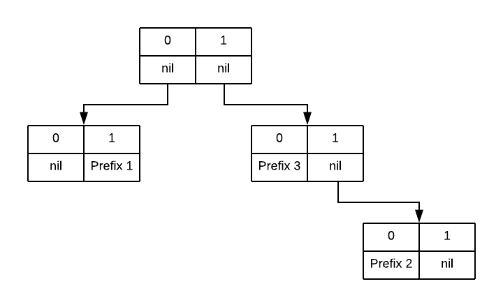
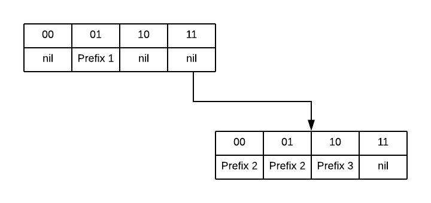

Determining if a subnet contains a given IP is a fundamental operation in
networking. Router dataplanes spend all of their time looking up prefix matches
to make forwarding decisions, but even higher layers of application code need
to perform this operation - for example, looking up a client IP address in a
geographical database or checking a client IP against an abuse blocklist.

Routers have extremely optimized implementations, but since these other uses
may be one-off codepaths in a higher-level language (eg. some random Go
microservice), they're not written with the same level of care and
optimization.  Sometimes they're written with no care or optimization at all
and quickly become bottlenecks.

Here's a list of basic techniques and tradeoffs to reference next time you need
to implement this form of lookup; I hope it's useful in determining a good
implementation for the level of optimization you need.

### Multiple Subnets

If you have multiple subnets and want to determine which of them match a given
IP (eg. longest prefix match), you should be reaching for something in the trie
family. I won't cover the fundamentals here, but do recommend _The Art of
Computer Programming, Vol.  3_ for an overview.

Be extremely skeptical of any off-the-shelf radix libraries:
1. Many do not do prefix compression
2. Many support N instead of two edges, which may lead to unnecessary memory overhead
3. Many will operate on some form of string type to be as generic as possible, again contributing to memory overhead
4. All be difficult to adapt to different stride lengths

I would highly recommend writing your own implementation if performance is a
concern at all. Most common implementations are either too generic or are optimized
for exact instead of prefix match.

#### unibit to multibit to compressed

A radix 2 trie that does bit-by-bit comparison with compression for empty nodes
is a good starting point. To further speed it up, you'll want to compare more
than one bit at a time - this is typically referred to as a multibit stride.

Multibit strides will get you significantly faster lookup time at the cost of
some memory - in order to align all comparisons on the stride size, you'll need
to expand some prefixes. 

As an example, let's say you're building a trie that contains three prefixes:
* Prefix 1: 01\*
* Prefix 2: 110\*
* Prefix 3: 10\*

A unibit trie would look like this:



If instead we want to use a multibit trie with a stride of two bits, then
prefix 2 needs to be expanded into its two sub-prefixes, 1101\* and 1100\*. Our
multibit trie would look like this:



Note how this trie has incresed our memory usage by duplicating prefix 2, but
has reduced our memory accesses and improved locality (there are far fewer
pointers chased in this diagram), thus trading memory usage for lookup
performance.

Most of the time a multibit trie is where you can stop. If you need to optimize
further, especially if you need to start reducing memory usage, then you'll
want to explore the literature on compressed tries. The general idea with many
of these is to use a longer or adaptive stride, but find clever ways to remove
some of the redundancy it introduces. Starting points include LC-tries, Luleå
tries, and tree bitmaps.

#### Modified traversals

There are some common, related problems that can be solved by small
modifications to the traversal algorithm:
* If instead of finding the longest
prefix match you need to find all containing subnets, simply keep track of the
list of all matching nodes instead of the single most recent node as you
traverse and return the full set at the end.
* If you need to match a containing subnet on some criteria other than most
specific match, for example declaration order from a config file, express this
as a numerical priority and persist it alongside the node. As you traverse,
keep track of the most recently visited node and only replace it if the
currently visited is a higher priority.

#### Sidenote on PATRICIA tries

PATRICIA tries are a radix 2 trie that saves a
count of bits skipped instead of the full substring when doing compression. You
don't want this! They're great for exact match lookup, like what you'd want in
a trie of filenames, but saving only the skip count causes prefix matches to
backtrack, resulting in significantly worse performance. It's unfortunate that
they're so often associated with networking; in some cases the name is misused
and people say PATRICIA when they simple mean radix 2.

### Single Subnet

If you have a large number of IPs and want to check if a single subnet contains
them, spend a little time looking at your assembler output to choose a good
implementation. If available, you're best off using 128-bit literals to support
IPv6. C, C++, Rust, and many systems languages will support this.
Unfortunately Go and Java do not, so you'll have to piece it together with two
64-bit integers - slightly cumbersome, and slightly more overhead as we'll see.


In IPv4, subnet contains checking is easy since everything fits in a word,
roughly:

```c
// checking if 1.2.3.0/8 contains 1.2.3.4
uint32_t prefix = 0x01020300; // prefix address, packed big endian
uint32_t client = 0x01020304; // client address, packed big endian
uint8_t mask = 8; // netmask, range 0-32
uint32_t bitmask = 0xFFFFFFFF << (32 - mask); // invert the mask to get a count of number of zeros
if ( (prefix & bitmask) == (client & bitmask) ) {
    // subnet contains client
}
```

IPv6 is when things get interesting. 128-bit long IPv6 addresses means juggling
two machine words. In computing the bitmask we need a mask for the upper and
the lower portion of the address.

```c
uint64_t upper_prefix, lower_prefix, upper_client, lower_client = ; // assume these are initialized
uint8_t mask = ;// netmask, range 0-128
uint64_t upper_bitmask = UINT64_MAX;
uint64_t lower_bitmask = UINT64_MAX;
if (mask < 64) {
    lower_bitmask <<= mask;
} else {
    upper_bitmask = lower_bitmask << (64 - mask);
    lower = 0;
}

if ((upper_prefix & upper_bitmask) == (upper_client & upper_bitmask) 
    && (lower_prefix & lower_bitmask) == (lower_client && lower_bitmask)) {
    // subnet contains client
}
```

Rewriting with gcc/clang's int128 emulated type:

```c
__uint128 prefix, client = ; // assume these are initialized
uint8_t mask = ;// netmask, range 0-128
__uint128 bitmask = std::numeric_limits<__uint128_t>::max() <<= (128 - mask);

if ( (prefix & bitmask) == (client & bitmask) ) {
    // subnet contains client
}
```

The emulated int128s are much easier to read and work with, but how does performance compare?

Here is the source code and [Godbolt link](https://godbolt.org/z/afNGvT) for a
small test, isolating just the shift portion:

```c
#include <cstdint>

__int128 shift128(uint8_t shift) {
    __int128 t = -1;
    t <<= shift; 
    return t;
}

struct Pair {
    uint64_t first, second;
};

Pair shift64(uint8_t shift) {
    uint64_t upper = -1;
    uint64_t lower = -1;
    if (shift < 64) {
        lower <<= shift;
    } else {
        upper = lower << (shift - 64);
        lower = 0;
    }

    return Pair{upper, lower};
}
```

And here is the compiler's optimized x86 assembly with comments added:

```gas
shift128(unsigned char):
        mov     ecx, edi ; load mask into ecx
        mov     rax, -1 ; initialize lower word
        xor     esi, esi ; zero this register for use in cmov
        mov     rdx, -1 ; initialize upper word
        sal     rax, cl ; shift lower word by mask
        and     ecx, 64 ; and our mask with 64
        cmovne  rdx, rax ; move lower word into upper
        cmovne  rax, rsi ; zero lower word
        ret
shift64(unsigned char):
        movzx   ecx, dil ; load mask into ecx
        cmp     dil, 63
        ja      .L4 ; jump if mask is >= 64
        mov     rdx, -1 ; initialize lower word
        mov     rax, -1 ; initialize upper word
        sal     rdx, cl ; shift lower word by mask
        ret
.L4:
        sub     ecx, 64 ; find out how much we need to shift the upper word by
        mov     rax, -1 ; initialize upper word
        xor     edx, edx ; mask was >64, so just zero the lower word
        sal     rax, cl ; shift upper word
        ret
```


There are a few interesting things to note:
1. `sal` will automatically mask its shift operand to the appropriate range, so
   while it's undefined behavior in C to shift by more than the size of the
target, this is fine at the asm level
2. `and` with 64 is using knowledge of undefined behavior - our shift is only
   well-defined within the range of 1-127, so we assume UB is impossible and
ignore the range outside.
3. `cmov` is used instead of a jump. On modern hardware this should be strictly
   better, though is most noticeable when jumps are unpredictable. Our jumps
should be very predictable here.

If we wanted, we could rewrite the int64 version in a way that would more
closely match the int128 assembly:

```c
Pair shift64_v2(uint8_t shift) {
    uint64_t upper = -1;
    uint64_t lower = -1;
    lower <<= (shift & 0x3F);
    if (shift > 0x3F) {
        upper = lower;
        lower = 0;
    }

    return Pair{upper, lower};
}
```

```gas
shift64_v2(unsigned char):
        mov     ecx, edi
        mov     rdx, -1
        mov     rax, -1
        sal     rdx, cl
        cmp     dil, 63
        jbe     .L4
        mov     rax, rdx
        xor     edx, edx
.L4:
        ret
```

Note how the assembly does not contain any explicit `and` with 0x3F, we've
merely communicated to the compiler that we want the `sal` instruction's
default mask behvior. Our `cmov` has also been converted to `jmp`.

Previously I'd hoped that I could use the 128-bit SSE registers and mm
intrinsics to operate on IPv6 addresses natively. However, operations to use
SSE registers as a single 128-bit value (as opposed to 2 64-bit values, 4
32-bit values, etc.) are quite limited. In particular, `_mm_slli_si128` shifts
by bytes instead of bits so won't work for our use case (though SIMD
instructions would be useful for performing matches against multiple client IPs
at once).
