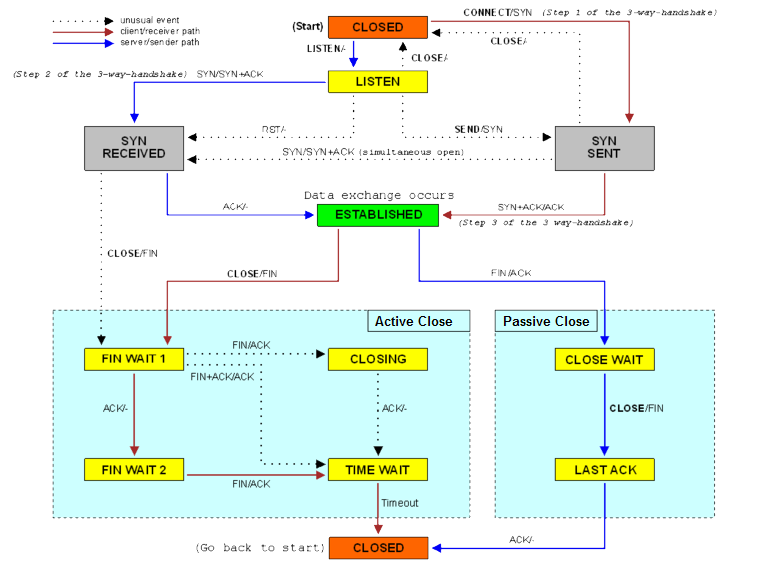

Many people are familiar with the 3-way handshake used to establish TCP, but may
not be as familiar with the 4-way (occasionally 3-way) handshake used to close a
TCP connection, ie. the bottom left section of this diagram:

The happy case for shutting down a connection is that the client sends a FIN to
the server and receives an ACK, then receives a FIN from the server and sends an
ACK.

But the server isn't necessarily under our control and may not be well-behaved,
and there's a flaky network between them to boot.  What happens when things go
wrong? In other words, what happens if we send a FIN, receive an ACK, then never
hear from the server again?

Strictly according to the RFCs, the socket will land in the FIN_WAIT_2 state
indefinitely, waiting for a FIN that will never come. The transition from
FIN_WAIT_2 to CLOSED is entirely application driven, so there would be nothing
to bail unsuspecting application developers out of this state if it weren't for
most operating systems choosing to deviate slightly from the standard.
Specifically, if a socket is shutdown such that the application will never read
nor write to it again (eg. `shutdown(sock, SHUT_RDWR)` or `close()`), the kernel
will apply a timeout to automatically transition from FIN_WAIT_2 to CLOSED
(controlled by `net.ipv4.tcp_fin_timeout` on Linux and `finwait2_timeout` on
FreeBSD). Thus the common case is covered and most people will never need to
think about this.

However! If you're dealing with half-closed connections (`shutdown(sock,
SHUT_RD/SHUT_WR)`) then those protections aren't applicable and it again becomes
easy to shoot yourself in the foot by accumulating an ever increasing number of
connections in FIN_WAIT_2. I've primarily seen this come up when working on
proxies that terminate at TCP, often for passthrough proxying with SNI sniffing - 
when you don't have visibility into the upper layer protocols it often makes
sense to structure the code as two separate half-duplex paths and use half-close
semantics. If you do this be aware of the FIN_WAIT_2 state and consider
reimplementing some form of idle timeout to transition the socket from
FIN_WAIT_2 to CLOSED.
