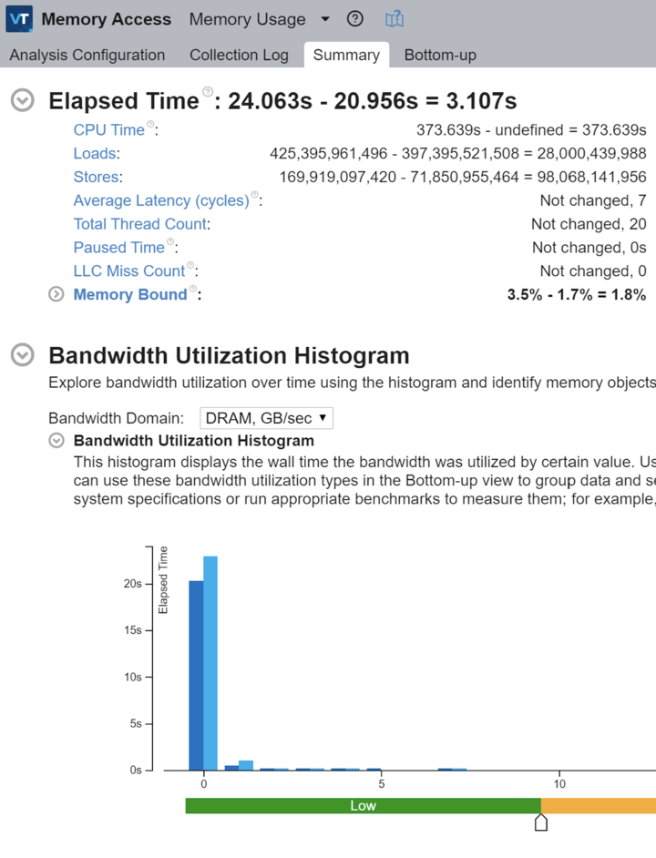

## The short version

Cargo builds like:
```bash
$ RUSTFLAGS="--emit asm" cargo build --release
$ cargo rustc --release -- --emit asm
```

Do not always output assembly equivalent to the machine code you'd get from:
```bash
$ cargo build --release
```

Possibly `rustc --emit=asm` has some uses, like examining a single file with
no external dependencies, but it's not useful for my normal case of wanting
to look at the asm for an arbitrary release build.

## The long version 

[Previously](/2020/11/06/simd-ray-tracer.html) I rewrote my ray tracer
to use `crossbeam::scope` and `crossbeam::queue` instead of rayon. Internally
rayon leans heavily on `crossbeam::deque` for its work-stealing implementation, so
my expectation was that this change would be neutral or a slight improvement, 
depending on how good of a job the compiler had been doing to condense
rayon's abstractions.

Instead it was a ~15% regression.

### Looking at the asm, pt. 1

The asm output appeared sane. I saw no expensive indirection, calls, etc. -
things were getting properly inlined and optimized.

### Understanding rayon

I first questioned my understanding of rayon and spent some time digging
through its guts. It's well-engineered, and it's impressive that clang's able
to condense all of its abstractions down into basically no overhead - but I also
didn't see anything fundamentally novel or surprising going on that would give it a significant performance edge. The
splitting/work assignment portion of the vec codepath looked like it would
lead to slightly more even partitioning than my hand-built crossbeam method,
but not by a lot, and definitely not by 15%. So that was bust. I did notice that
crossbeam needed to heap allocate the closure I was using for my thread body,
so perhaps that caused some additional overhead, but it should have been
negligible.

### CPU profiling

At this point I dumped both versions into Instruments and did some basic CPU
profiling. rayon's a bit annoying to poke around in because you end up with
extremely deep stacks of `join` frames, but nothing really stood out. The
crossbeam version was simply slower with no major red flags.

### More in-depth CPU profiling

I'd been looking for an excuse to try [Intel
VTune](https://software.intel.com/content/www/us/en/develop/tools/vtune-profiler.html)
for awhile, but since it's only supported on Windows and Linux and is best
run on bare-metal, it had always been slightly too much effort to stand up
for smaller projects. It seemed warranted for this one! I had an existing
Windows bootcamp partition, so figured I'd see just how much hassle it was to
get everything working in that before I dusted off something to run Linux.

Sidebar: turns out Rust on Windows is... really nice. I'm not a Windows dev. There are
things I admire about the ecosystem (like a good first-party
debugger and some decent OS APIs), but apart from some Java way back in high
school I've never even tried to compile software on a Windows machine. It
always looked like a nightmare for C/C++ projects - I'm familiar enough with
the code side of cross-platform support, but as for actually
building things... I think cmake can spit out a Visual Studio project? And I
keep hearing about WSL? So I went in with significant trepidation. Turns out
it took all of ten minutes to install the VS C++ tools, rustup, a rust
toolchain, vtune, and get everything building and working together. Pretty
impressive.

VTune itself is a complex beast. Most (all?) of the data in it is stuff you
could get out of `perf`, but the collection and workflow is streamlined - it
does a good job of keeping track of previous runs, grouping them in a way so
you don't lose anything, surfacing useful information based on top-level
categories (eg. "I want to look at memory access"), and providing a 
diff view between runs. It looks particularly useful for guiding iterative optimization
and refinement. It's a bit less useful when I'm comparing the
performance of two fairly different programs, because many of the stack
traces are unique to either the rayon or crossbeam version, so "you have 100%
more of these rayon stack traces in this run" is not helpful. Looking through
the data I saw that I was getting flagged on uarch perf, retiring
instructions maybe 5% worse in the crossbeam version. Thinking that could be
stalling waiting on memory, I ran a memory access profile and saw:



Crossbeam version is on the left, rayon version is on the right. Okay, 3s
runtime difference - that's commensurate with the perf regression I'm seeing.
Interesting, we're memory bound twice as frequently. That's strange because
our memory access pattern should be pretty similar. We're doing over twice as
many stores. We're doing some additional loads. We're...

Wait.

We're doing over twice as many stores?! That doesn't make sense.

### Replacing crossbeam::scope

Perhaps heap allocating the closures was more expensive than I thought, or
had bad knock-on effects. It's a long shot, but the whole point of side
projects is following some of those random tangents. I set about eliminating
`crossbeam::scope` and using `std::thread` directly instead. This was a quick
and dirty test: the entire point of `scope` is to create an abstraction that
communicates to the borrow checker that threads we've spun off have been
joined, otherwise it doesn't know when a thread's borrow is guaranteed to
have ended and requires that data references from a thread's closure are all
static lifetime. In this case I'm manually joining the threads, so I can do a
transmute to placate the compiler. Don't ship code like this, it defeats the
purpose of using Rust in the first place - you'd have a better experience
with C++. But it can be really handy to circumvent these sorts of checks when
doing quick prototyping/performance analysis to decide if it's worth the time
to build out a safe abstraction. I would welcome a "just build this without
the borrow checker" mode for cases like this, though I'm probably in the
minority and I don't expect that would be an easy feature to add.

My testing code looked roughly like this:
```rust
let pixels = unsafe { 
    mem::transmute::<&mut [V3], &'static mut [V3]>(pixels)
};
let handle = std::thread::spawn(move || {
    // code that uses &pixels
});
handle.join().unwrap();
```

As expected, no significant performance gains were had.

### Looking at the asm, pt. 2...

Something isn't adding up so I want to look at the assembly again, but I'd like to
clearly distinguish between my unchanged business logic and the
rayon/crossbeam coordination code. The majority of my business logic is
behind a single function named `cast`; adding `#[inline(never)]` to that single ray processing function
should give me a nice seam between rayon and my business logic.

Build, run and the rayon version slows down... in fact it runs exactly as slow as the crossbeam
version.

I try adding `#[inline(always)]` to the `cast` function in the crossbeam
version, and lo and behold it speeds up to match the original rayon version,
my regression disappears.

But, how's that possible? The _first_ thing I did was look at inlining. Maybe
my quick once-over missed it, maybe I misread and this whole circuitous path
is all my fault?

I generated assembly output for both the inlined and noninlined versions of the crossbeam ray tracer:
```bash
$ rg ecl_rt4cast inline.s 
21293:	.asciz	"_ZN6ecl_rt4cast17hc1100eade04dff75E"
$ rg ecl_rt4cast noinline.s 
21293:	.asciz	"_ZN6ecl_rt4cast17hc1100eade04dff75E"
```

I'm building release with symbols, so that string is expected. But neither
version, not even the non-inlined version, is making calls to `cast()`.
Curious.
```bash
$ wc -l inline.s 
203969 inline.s
$ wc -l noinline.s 
203969 noinline.s
```

Now I feel like I'm being gaslighted. These are the exact same length. A diff
shows that the only changes are some arbitrary IDs in debug info. I have a
difficult relationship with optimizing compilers, so my first thought is maybe
clang's being clang again and I should go validate the binaries instead...

```bash
$ objdump -d ecl_rt_inline | rg ecl_rt4cast
<no output>
$ objdump -d ecl_rt_noinline | rg ecl_rt4cast
0000000100003190 __ZN6ecl_rt4cast17hc1100eade04dff75E:
100003299: e9 af 01 00 00              	jmp	431 <__ZN6ecl_rt4cast17hc1100eade04dff75E+0x2bd>
1000034a2: eb 1f                       	jmp	31 <__ZN6ecl_rt4cast17hc1100eade04dff75E+0x333>
1000034c6: 74 38                       	je	56 <__ZN6ecl_rt4cast17hc1100eade04dff75E+0x370>
1000034e5: 0f 82 f5 00 00 00           	jb	245 <__ZN6ecl_rt4cast17hc1100eade04dff75E+0x450>
1000034ee: 72 1d                       	jb	29 <__ZN6ecl_rt4cast17hc1100eade04dff75E+0x37d>
1000034f0: e9 eb 00 00 00              	jmp	235 <__ZN6ecl_rt4cast17hc1100eade04dff75E+0x450>
100003503: 0f 83 d7 00 00 00           	jae	215 <__ZN6ecl_rt4cast17hc1100eade04dff75E+0x450>
100003515: 0f 87 16 03 00 00           	ja	790 <__ZN6ecl_rt4cast17hc1100eade04dff75E+0x6a1>
10000351e: 0f 82 1f 03 00 00           	jb	799 <__ZN6ecl_rt4cast17hc1100eade04dff75E+0x6b3>
100003527: 0f 82 2b 03 00 00           	jb	811 <__ZN6ecl_rt4cast17hc1100eade04dff75E+0x6c8>
100003530: 0f 82 37 03 00 00           	jb	823 <__ZN6ecl_rt4cast17hc1100eade04dff75E+0x6dd>
100003539: 0f 82 40 03 00 00           	jb	832 <__ZN6ecl_rt4cast17hc1100eade04dff75E+0x6ef>
100003590: 0f 84 1a ff ff ff           	je	-230 <__ZN6ecl_rt4cast17hc1100eade04dff75E+0x320>
1000035db: e9 d0 fe ff ff              	jmp	-304 <__ZN6ecl_rt4cast17hc1100eade04dff75E+0x320>
10000360a: 0f 86 a1 01 00 00           	jbe	417 <__ZN6ecl_rt4cast17hc1100eade04dff75E+0x621>
100003637: 0f 87 57 02 00 00           	ja	599 <__ZN6ecl_rt4cast17hc1100eade04dff75E+0x704>
100003668: 0f 86 3d 02 00 00           	jbe	573 <__ZN6ecl_rt4cast17hc1100eade04dff75E+0x71b>
100003682: 0f 84 41 01 00 00           	je	321 <__ZN6ecl_rt4cast17hc1100eade04dff75E+0x639>
100003707: 0f 85 93 fb ff ff           	jne	-1133 <__ZN6ecl_rt4cast17hc1100eade04dff75E+0x110>
10000371a: 0f 86 9f 01 00 00           	jbe	415 <__ZN6ecl_rt4cast17hc1100eade04dff75E+0x72f>
100003723: 0f 86 a8 01 00 00           	jbe	424 <__ZN6ecl_rt4cast17hc1100eade04dff75E+0x741>
10000372c: 0f 86 b1 01 00 00           	jbe	433 <__ZN6ecl_rt4cast17hc1100eade04dff75E+0x753>
1000037ac: e9 57 fc ff ff              	jmp	-937 <__ZN6ecl_rt4cast17hc1100eade04dff75E+0x278>
1000037c7: eb 12                       	jmp	18 <__ZN6ecl_rt4cast17hc1100eade04dff75E+0x64b>
100009740: e8 4b 9a ff ff              	callq	-26037 <__ZN6ecl_rt4cast17hc1100eade04dff75E>
```

Bingo - note the `callq`. Clearly my crossbeam version wasn't inlining as
aggresively as the rayon version, possibly due to the `Box::new(closure)`.
Instructing the compiler to do so brought performance in line with
expectations. It's silly that the compiler wasn't inlining it in the first
place, this function has a single callsite and inlining it improves both
runtime performance and binary size.

That means `--emit=asm` does something entirely unexpected. I dug around and sure enough [there are
reports](https://users.rust-lang.org/t/emit-asm-changes-the-produced-machine-code/17701/4)
that running with `--emit=asm` will build with a different configuration due
to interaction with ThinLTO and codegen units.

### Fin

It's not ideal to rely on disassemblers because they're also fallible. In the
same way that going from C to asm loses fidelity and makes decompiling from
asm to C difficult, going from asm to machine code also loses fidelity and
there can be inconsistenices when disassembling machine code back into asm.

The common disassemblers like `objdump` are linear sweep and can suffer from
mistaking data for code. There's another family of disassemblers based on
recursive traversal that avoid those problems, but come with their own set of
tradeoffs. 

Note that the learning curve on disassemblers can be steep. These tools are
often packaged into a suite and targeted towards reverse engineering and
malware analysis, they come with far more features than "give me a good
disassembly and make it easy to visualize/browse." Hopefully it'll be easier
to match the `--emit=asm` build config to a normal release build config in
the future, but until then I'll be getting comfortable with
[Ghidra](https://ghidra-sre.org).