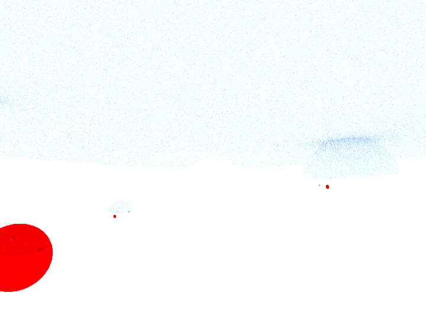
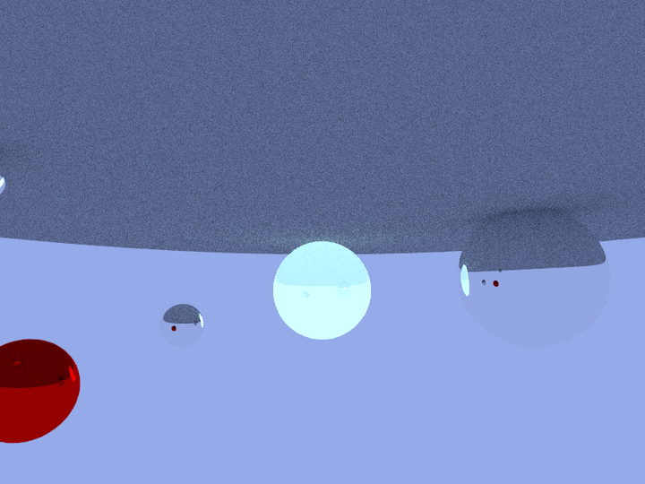
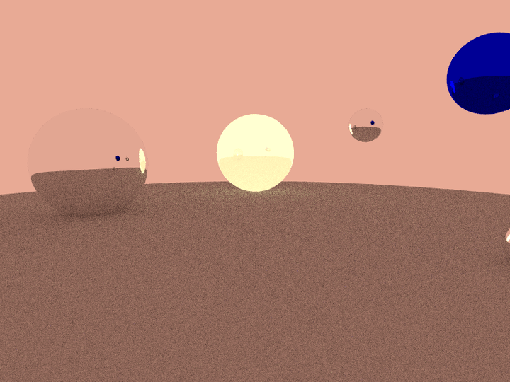
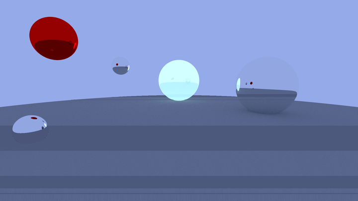
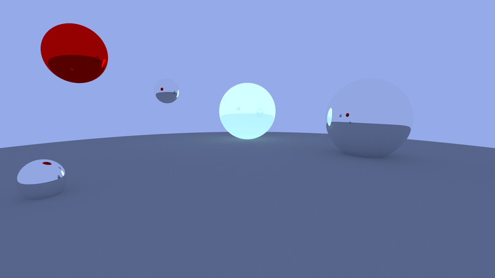

I needed to pick up Rust for work, so I ported my existing ray tracer to the
language for a little practice. It's now in the unimaginatively named
[ecl_rt](https://github.com/elindsey/ecl_rrt).

Overall it was a pleasant experience. I particularly like Rust's object system
(am I allowed to call it that?), the bounded generics, how it handles numeric
primitives (requiring explicit conversion, giving easy, explicit control of
overflow behavior), the focus on expressions, and the rayon library. The
ML aspects are refreshing, but easy to overdo.

The development environment is fairly good, though I did hit a bug in rust
analyzer and at one point had to wipe my build directory because cargo got
confused and everything started failing to link.

The initial port was ~40% slower than the equivalent C99 codebase. Replacing
the rand crate with the same custom PRNG I use in
[ecl_rt_legacy](https://github.com/elindsey/ecl_rt_legacy) closed the gap to 15-20%. That's
still much higher than I'd like, but I haven't had time to dig into it in
depth. I can say that it's not related to threading and nothing in the Rust
assembly looks _too_ off - bounds checking isn't hurting me very much, there
aren't a lot of extra function calls, etc. It seems that clang is optimizing
the giant wad of floating point calculations slightly better, but I haven't
looked into what exactly it's doing differently.

### Whiteout

My initial render wasn't too far off - at least it made an image! I forgot to average the pixel color values back down, so everything trended towards full white the longer the ray tracer ran.

### Upside Down

With whiteout fixed, the next obvious problem is the image is upside down. This is common because images are represented as a giant flat buffer of pixel values, so when you go from an in memory representation to an image library or format you need to agree on how that buffer is stacked and unstacked, ie. does the first item in the buffer correspond to the top left or the bottom left pixel of the image. So I just reversed the buffer...

### Mirrored Colors

Oops. In reversing the buffer I accidentally reversed my color channels, so red is blue and blue is red.

### Band Artifacts

I flipped the colors, but tried to get too clever with the PRNG. In this image I tried to seed my PRNG with the thread ID - which would be fine, except rayon was calling my seed function each time it checked out work from the job pool. Instead of a thread seeding once, it would reseed with the thread ID approximately fifty times over the course of the run. This causes visibile artifacting and the bands you see in the image. Rather than adjust it to only seed once, I opted to used the rand crate for reseeding (it's so few calls that the overhead is negligible).

### Finally...

And now everything is sorted and we're comparable to the ecl_rt reference image!

